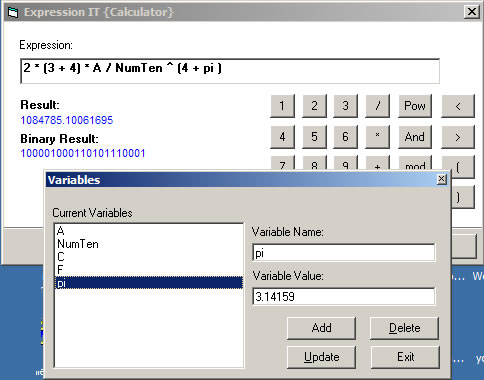



## DM Expression calculator

### Description

hi This is a small Expression calculator I made in VB anyway can work with almost any expression, has variable support, Works with Floating point number, brackets, operators suppoted +=*/\.&lt; &gt;= and more. Anyway hope you like it. Most of all the Expression calculator class has been commented please vote if you this code.
 
### More Info
 
No support for in-built functions yet

             |
---                |---
**Submitted On**   |2002-11-26 09:04:18
**By**             |[dreamvb](https://github.com/Planet-Source-Code/PSCIndex/blob/master/ByAuthor/dreamvb.md)
**Level**          |Beginner
**User Rating**    |4.7 (14 globes from 3 users)
**Compatibility**  |VB 5\.0, VB 6\.0
**Category**       |[Math/ Dates](https://github.com/Planet-Source-Code/PSCIndex/blob/master/ByCategory/math-dates__1-37.md)
**World**          |[Visual Basic](https://github.com/Planet-Source-Code/PSCIndex/blob/master/ByWorld/visual-basic.md)
**Archive File**   |[DM\_Express19515911272005\.zip](https://github.com/Planet-Source-Code/dreamvb-dm-expression-calculator__1-63400/archive/master.zip)

